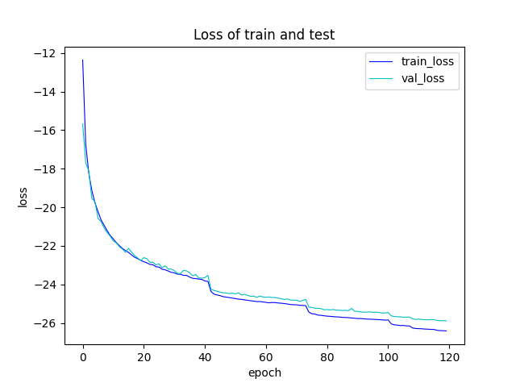

# Conv-TasNet

An Oneflow implementation of Conv-TasNet described in [TasNet: Surpassing Ideal Time-Frequency Masking for Speech Separation](https://arxiv.org/abs/1809.07454)


## Requirements

```bash
pip install -r requirements.txt
```

## Data
We train and evaluate our models on the partial data from WSJ0-2mix, which is not an open-source dataset and can be found [here](https://catalog.ldc.upenn.edu/LDC93S6A).


## Usage
```bash
bash run.sh
```
That's all!

## Visualization of loss

 

## Result

  |         | Loss |SI-SDR(dB)|Pretrained Model |
  | :---: | :---: |  :---: | :---: |
  |   Oneflow   | -25.887|25.227|[ConvTasnet_Model](https://oneflow-public.oss-cn-beijing.aliyuncs.com/model_zoo/audio/Conv-TasNet.zip)|
  |   Pytorch   | -25.727|26.127 |--- |

 
## Separation demo
 |   Original mixed voice      | The first seperated voice |The second seperated voice |
| :---: | :---: |  :---: | 
|[Original mixed voice](figure_and_demo/mix_01ao0319_1.5938_209a010t_-1.5938.wav)|[The first seperated voice](figure_and_demo/first_01ao0319_1.5938_209a010t_-1.5938.wav)|[The second seperated voice](figure_and_demo/second_01ao0319_1.5938_209a010t_-1.5938.wav)|


## Reference

Luo Y, Mesgarani N. TasNet: Surpassing Ideal Time-Frequency Masking for Speech Separation[J]. arXiv preprint arXiv:1809.07454, 2018.