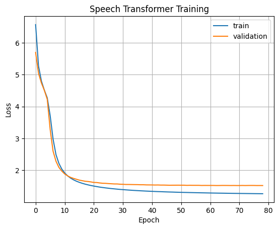

# Speech Transformer: End-to-End ASR with Transformer

An Oneflow implementation of Speech Transformer [1], an end-to-end automatic speech recognition with [Transformer](https://arxiv.org/abs/1706.03762) network, which directly converts acoustic features to character sequence using a single nueral network.

Our code is inspired by the Pytorch implementation [Speech-Transformer](https://github.com/kaituoxu/Speech-Transformer).


## Install
- Python3 (recommend Anaconda)
- Oneflow 0.5.0
- [Kaldi](https://github.com/kaldi-asr/kaldi) (just for feature extraction)
- `cd tools; make KALDI=/path/to/kaldi`
- If you want to run `egs/aishell/run.sh`, download [aishell](http://www.openslr.org/33/) dataset for free.

## Usage


### Quick start
```bash
cd egs/aishell
# Modify aishell data path to your path in the begining of run.sh 
bash run.sh
```
That's all!

You can change parameter by `bash run.sh --parameter_name parameter_value`. For example, `bash run.sh --stage 3`. See parameter name in `egs/aishell/run.sh` before `. utils/parse_options.sh`.

### Workflow
Workflow of `egs/aishell/run.sh`:
- Stage 0: Data Preparation
- Stage 1: Feature Generation
- Stage 2: Dictionary and Json Data Preparation
- Stage 3: Network Training
- Stage 4: Decoding

### More detail
`egs/aishell/run.sh` provide example usage.
```bash
# Set PATH and PYTHONPATH
cd egs/aishell/; . ./path.sh
# Train
train.py -h
# Decode
recognize.py -h
```
### How to visualize loss?
If you want to visualize your loss, you can make use of [loss_visualize.py](egs/aishell/loss_visualize.py), in which you can change parameters by `python loss_visualize.py --parameter_name parameter_value`.

For example, here we visualize the loss in the begining of 79 training epoches. (since we found that the model was no longer improved after the 79th epoch). 




## Results
| Model | Batch_frames | Epoch | CER |Pretrained Model |
| :---: | :-: | :----: |:----: |:----: |
| Oneflow | 15000 |150|9.8|[15k_model](https://oneflow-public.oss-cn-beijing.aliyuncs.com/model_zoo/audio/SpeechTransfomer.zip)|
| Oneflow | 30000 |150|9.3|[30k_model](https://oneflow-public.oss-cn-beijing.aliyuncs.com/model_zoo/audio/SpeechTransfomer.zip)|
| Pytorch | 15000 |150|13.2 | --- |

## Reference
- [1] Yuanyuan Zhao, Jie Li, Xiaorui Wang, and Yan Li. "The SpeechTransformer for Large-scale Mandarin Chinese Speech Recognition." ICASSP 2019.
