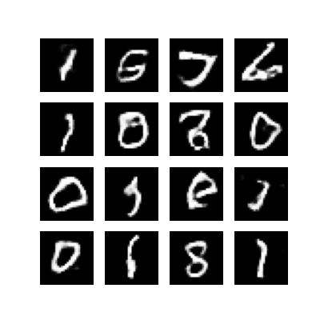

# DCGAN

DCGAN is an unconditional image generation method ([code](https://github.com/Oneflow-Inc/oneflow_vision_model/tree/main/DCGAN) in lazy mode), our code is inspired by [TensorFlow Tutorial](https://tensorflow.google.cn/tutorials/generative/dcgan).


## Train on [mnist](http://yann.lecun.com/exdb/mnist/) Dataset
### Run Oneflow Training script

```bash
bash train_of_dcgan.sh
```

## Inference
### Run Oneflow Inference script

```bash
bash test_of_dcgan.sh
```

Inference results

