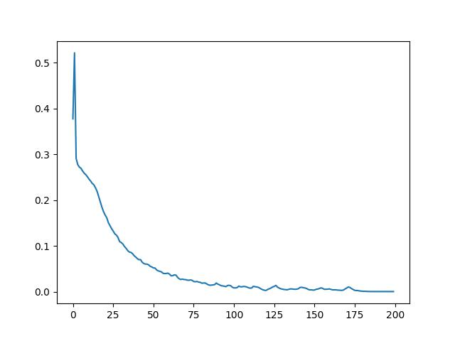

# Deep&Cross
 [Deep & Cross Network](https://dl.acm.org/doi/10.1145/3124749.3124754) (DCN) can not only keep the advantages of DNN model, but also learn specific bounded feature crossover more effectively. In particular, DCN can explicitly learn cross features for each layer without the need for manual feature engineering, and the increased algorithm complexity is almost negligible compared with DNN model.

## Pretrained Model
Pretrained DCN model was trained on pytorch, and then converted to onflow.

download link: [pretrained](https://oneflow-public.oss-cn-beijing.aliyuncs.com/model_zoo/RecommenderSystems/dcn/frappe-pretrained.zip)

## frappe dataset

Frappe dataset can be downloaded [here](https://www.baltrunas.info/context-aware)

|model|logloss|auc|
|-|-|-|
|DCN-pytorch|0.771|0.9752|
|DCN-oneflow(load torch dict)|0.7795|0.9752|
 
 

