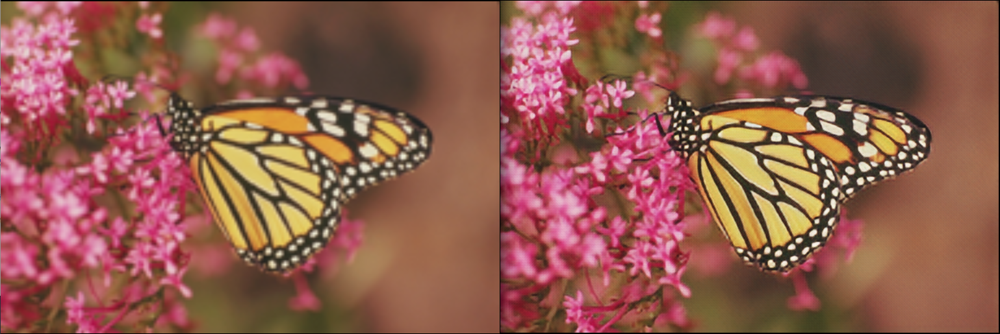

# SRGAN
SRGAN, [Photo-Realistic Single Image Super-Resolution Using a Generative Adversarial Network](https://arxiv.org/abs/1609.04802), is an image super resolution model. The code in lazy mode in [here](https://github.com/Oneflow-Inc/oneflow_vision_model/tree/main/SRGAN).
## Train
```
bash train_of_srgan.sh
```

The train, val dataset of [VOC2012](http://host.robots.ox.ac.uk:8080/pascal/VOC/voc2012/index.html)  and pretrained model for perceptual loss will be downloaded to './data/VOC' and './vgg_imagenet_pretrain_model' folder, respectively.


## Test Single Image
```
bash test_of_srgan.sh
```
The trained model will be automatically download.

Inference results

