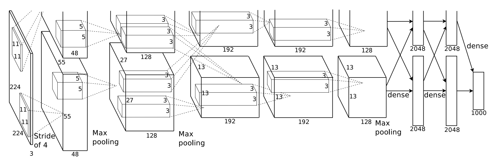
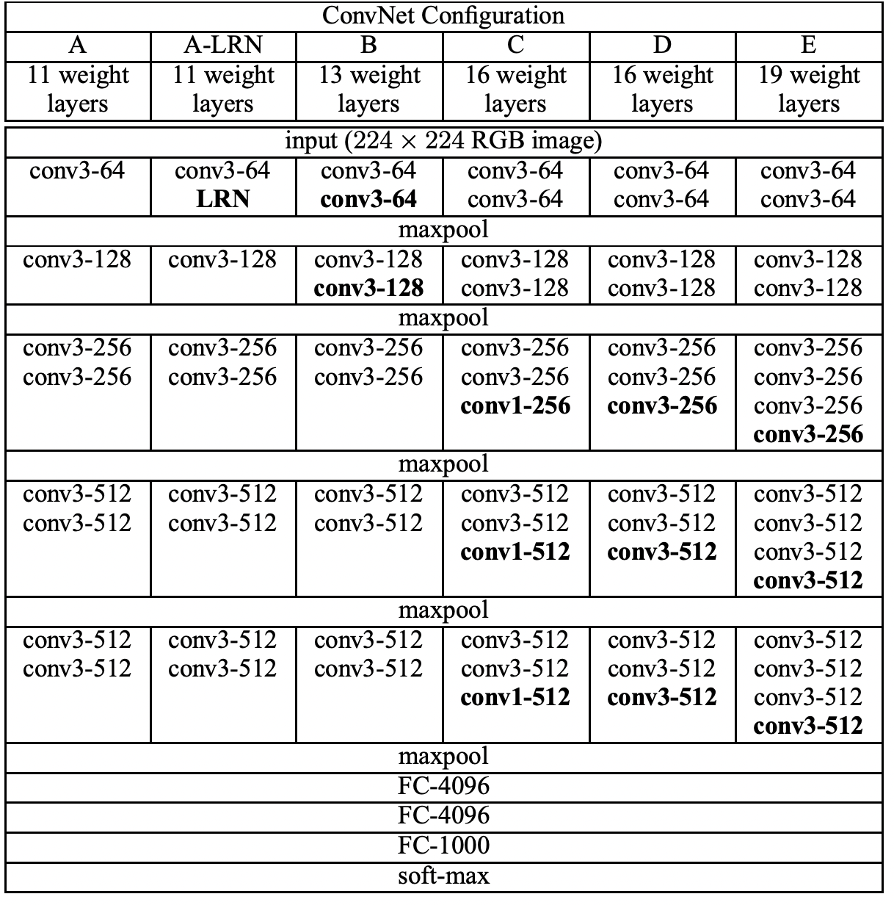
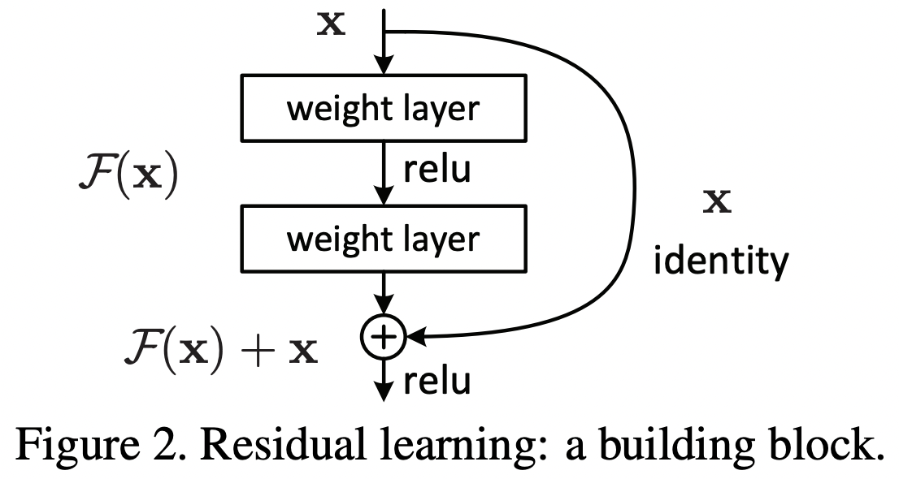
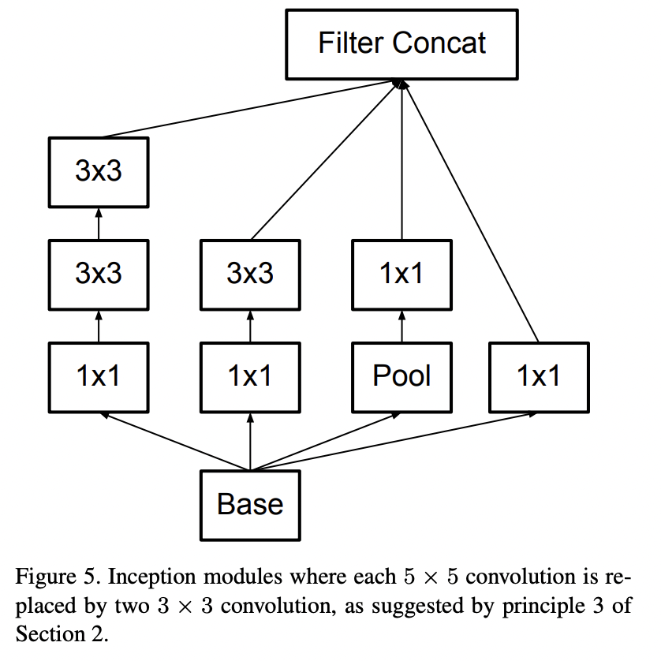
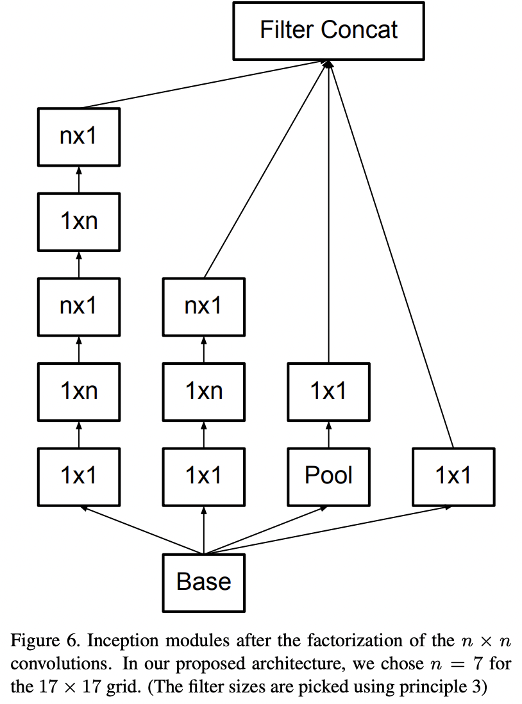
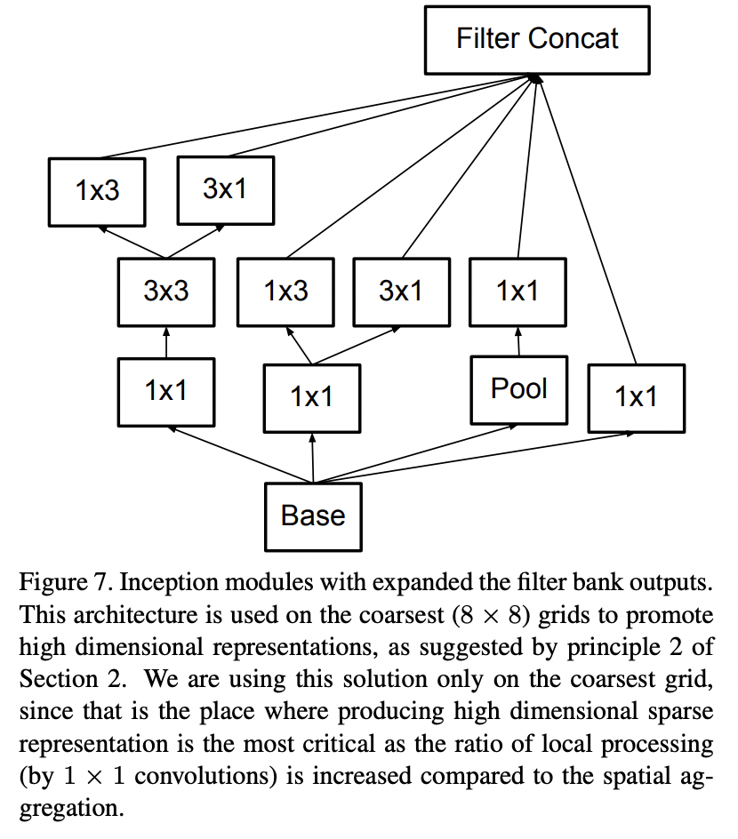
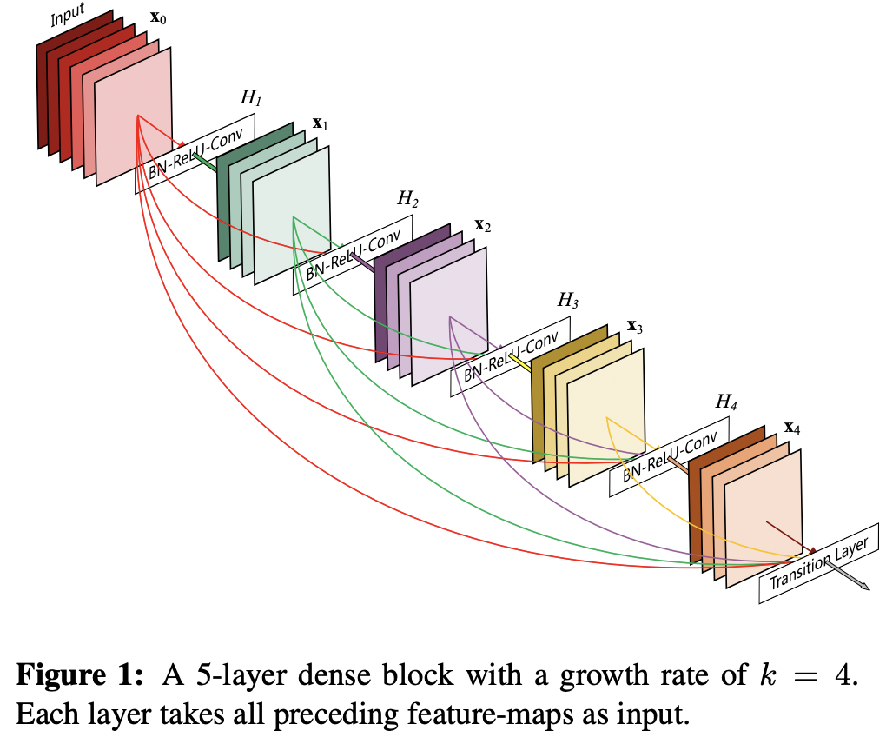
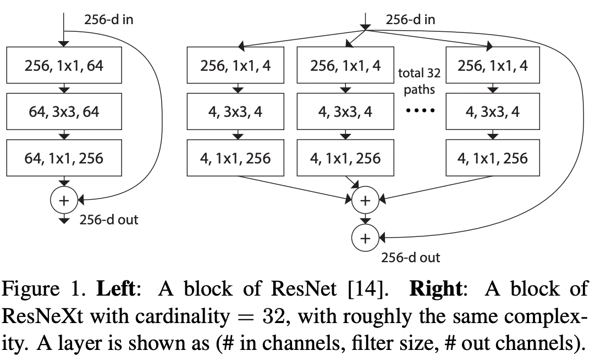
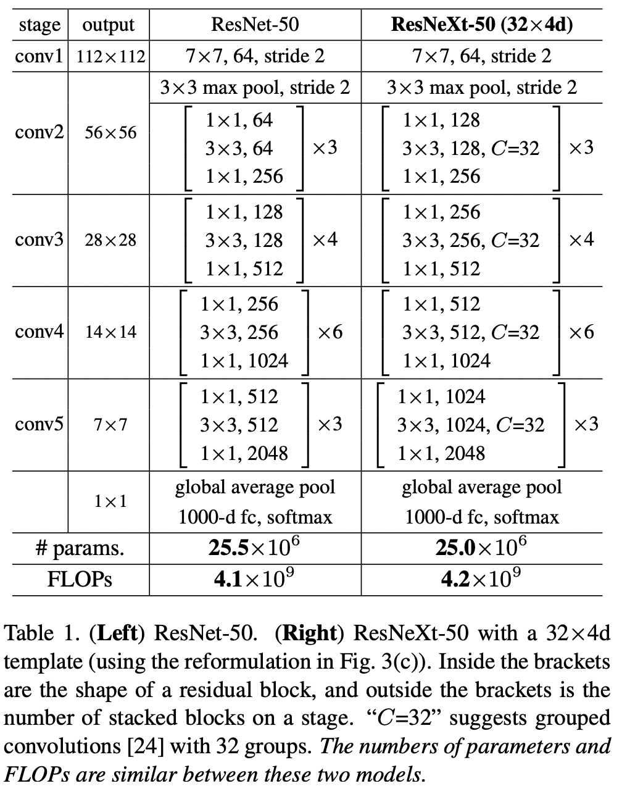

# Computer Vision

## Image Classification
### Lenet

- **Quick Start:** [lenet](https://github.com/Oneflow-Inc/models/blob/main/Demo/quick_start_demo_lenet/lenet.py)

### Alexnet
- **Network Design**
> AlexNet contained eight layers; the first five were convolutional layers, some of them followed by max-pooling layers, and the last three were fully connected layers. It used the non-saturating ReLU activation function, which showed improved training performance over tanh and sigmoid. 

- **Network Overall**

	

- **Relative Paper:** [ImageNet Classification with Deep Convolutional
Neural Networks](https://proceedings.neurips.cc/paper/2012/file/c399862d3b9d6b76c8436e924a68c45b-Paper.pdf)
- **Quick Start:** [here](https://github.com/Oneflow-Inc/models/tree/main/Vision/classification/image/alexnet)

### VGG
- **Network Design**
> VGG is a classical convolutional neural network architecture. It was based on an analysis of how to increase the depth of such networks. The network utilises small 3 x 3 filters. Otherwise the network is characterized by its simplicity: the only other components being pooling layers and a fully connected layer.

- **Network Overall**

	

- **Relative Paper:** [Very Deep Convolutional Networks for Large-Scale Image Recognition](https://arxiv.org/abs/1409.1556)
- **Quick Start:** [here](https://github.com/Oneflow-Inc/models/tree/main/Vision/classification/image/vgg)

### Resnet50
- **Network Design**
> Residual Networks, or ResNets, learn residual functions with reference to the layer inputs, instead of learning unreferenced functions. Instead of hoping each few stacked layers directly fit a desired underlying mapping, residual nets let these layers fit a residual mapping. They stack residual blocks ontop of each other to form network: e.g. a ResNet-50 has fifty layers using these blocks.There is empirical evidence that these types of network are easier to optimize, and can gain accuracy from considerably increased depth.

- **Residual Learning block**

	

- **Relative Paper:** [Deep Residual Learning for Image Recognition](https://arxiv.org/abs/1512.03385v1)
- **Quick Start:** [here](https://github.com/Oneflow-Inc/models/tree/main/Vision/classification/image/resnet50)

### InceptionV3
- **Network Design**
> Inception-v3 is a convolutional neural network architecture from the Inception family that makes several improvements including using Label Smoothing, Factorized 7 x 7 convolutions, and the use of an auxiliary classifer to propagate label information lower down the network (along with the use of batch normalization for layers in the sidehead).

- **Inception Block**

	

	

	

- **Relative Paper:** [Rethinking the Inception Architecture for Computer Vision](https://arxiv.org/pdf/1512.00567.pdf)
- **Quick Start:** [here](https://github.com/Oneflow-Inc/models/tree/main/Vision/classification/image/inception_v3)

### Densenet
- **Network Design**
A DenseNet is a type of convolutional neural network that utilises dense connections between layers, through Dense Blocks, where we connect all layers (with matching feature-map sizes) directly with each other. To preserve the feed-forward nature, each layer obtains additional inputs from all preceding layers and passes on its own feature-maps to all subsequent layers.

- **Dense Block**

	

- **Relative Paper:** [Densely Connected Convolutional Networks](https://arxiv.org/abs/1608.06993v5)
- **Quick Start:** [here](https://github.com/Oneflow-Inc/models/tree/main/Vision/classification/image/densenet)

### Resnext50_32x4d
- **Network Design**
> A ResNeXt repeats a building block that aggregates a set of transformations with the same topology. Compared to a ResNet, it exposes a new dimension, cardinality (the size of the set of transformations) , as an essential factor in addition to the dimensions of depth and width.

- **ResNet Block vs ResNext Block**

	

- **ResNet vs ResNext**

	

- **Relative Paper:** [Aggregated Residual Transformations for Deep Neural Networks](https://arxiv.org/pdf/1611.05431v2.pdf)
- **Quick Start:** [here](https://github.com/Oneflow-Inc/models/tree/main/Vision/classification/image/resnext50_32x4d)

### [Shufflenetv2](https://github.com/Oneflow-Inc/models/tree/main/Vision/classification/image/shufflenetv2)
### [MobilenetV2](https://github.com/Oneflow-Inc/models/tree/main/Vision/classification/image/mobilenetv2)
### [mobilenetv3](https://github.com/Oneflow-Inc/models/tree/main/Vision/classification/image/mobilenetv3)
### [Ghostnet](https://github.com/Oneflow-Inc/models/tree/main/Vision/classification/image/ghostnet)
### [RepVGG](https://github.com/Oneflow-Inc/models/tree/main/Vision/classification/image/repvgg)
### [Mnasnet](https://github.com/Oneflow-Inc/models/tree/main/Vision/classification/image/mnasnet)
### [DLA](https://github.com/Oneflow-Inc/models/tree/main/Vision/classification/image/DLA)
### [PoseNet](https://github.com/Oneflow-Inc/models/tree/main/Vision/classification/image/poseNet)
### [Scnet](https://github.com/Oneflow-Inc/models/tree/main/Vision/classification/image/scnet)

## Video Classification
### [TSN](https://github.com/Oneflow-Inc/models/tree/main/Vision/classification/video/TSN)

## Object Detection
### [CSRNet](https://github.com/Oneflow-Inc/models/tree/main/Vision/detection/CSRNet)

## Semantic Segmentation
### [FODDet](https://github.com/Oneflow-Inc/models/tree/main/Vision/segmentation/FODDet)
### [FaceSeg](https://github.com/Oneflow-Inc/models/tree/main/Vision/segmentation/FaceSeg)

## Generative Adversarial Networks
### [DCGAN](https://github.com/Oneflow-Inc/models/tree/main/Vision/gan/DCGAN)
### [SRGAN](https://github.com/Oneflow-Inc/models/tree/main/Vision/gan/SRGAN)
### [Pix2Pix](https://github.com/Oneflow-Inc/models/tree/main/Vision/gan/pix2pix)
### [CycleGAN](https://github.com/Oneflow-Inc/models/tree/main/Vision/gan/cycleGAN)

## Neural Style Transform
### [FastNeuralStyle](https://github.com/Oneflow-Inc/models/tree/main/Vision/style_transform/fast_neural_style)

## Person Re-identification
### [BoT](https://github.com/Oneflow-Inc/models/tree/main/Vision/reid/BoT)
