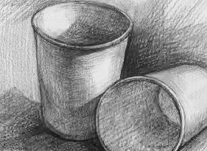
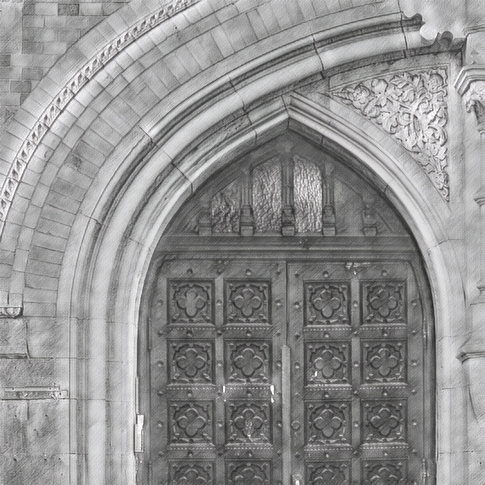

# fast-neural-style :city_sunrise: :rocket:
This repository contains a oneflow implementation of an algorithm for artistic style transfer. The algorithm can be used to mix the content of an image with the style of another image. For example, here is a photograph of a door arch rendered in the style of a sketch.

The model uses the method described in [Perceptual Losses for Real-Time Style Transfer and Super-Resolution](https://arxiv.org/abs/1603.08155) along with [Instance Normalization](https://arxiv.org/pdf/1607.08022.pdf). The saved-models for examples shown in the README can be downloaded from [here](https://www.dropbox.com/s/lrvwfehqdcxoza8/saved_models.zip?dl=0).

<p align="center">
    
    
    
</p>

For inferring, run
```
bash infer.sh
```
To customize infer process, see comment in `infer.sh`.

For training, first download coco dataset from http://msvocds.blob.core.windows.net/coco2015/test2015.zip.
Set dataset directory in train.sh. Hyperparameters can be customized. See comment in `train.sh`. Run
```
bash train.sh
```