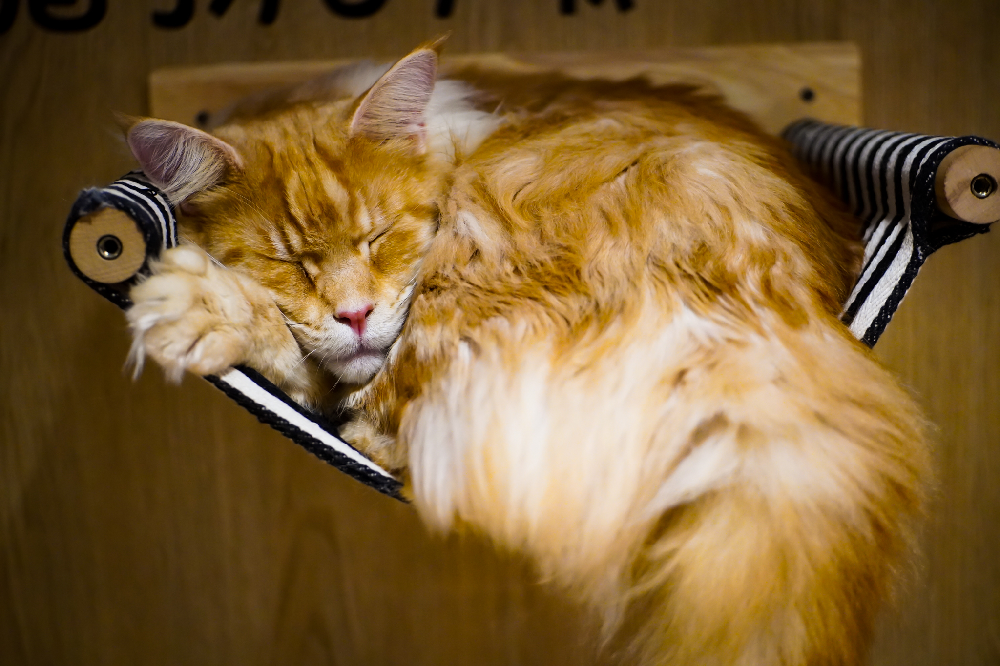
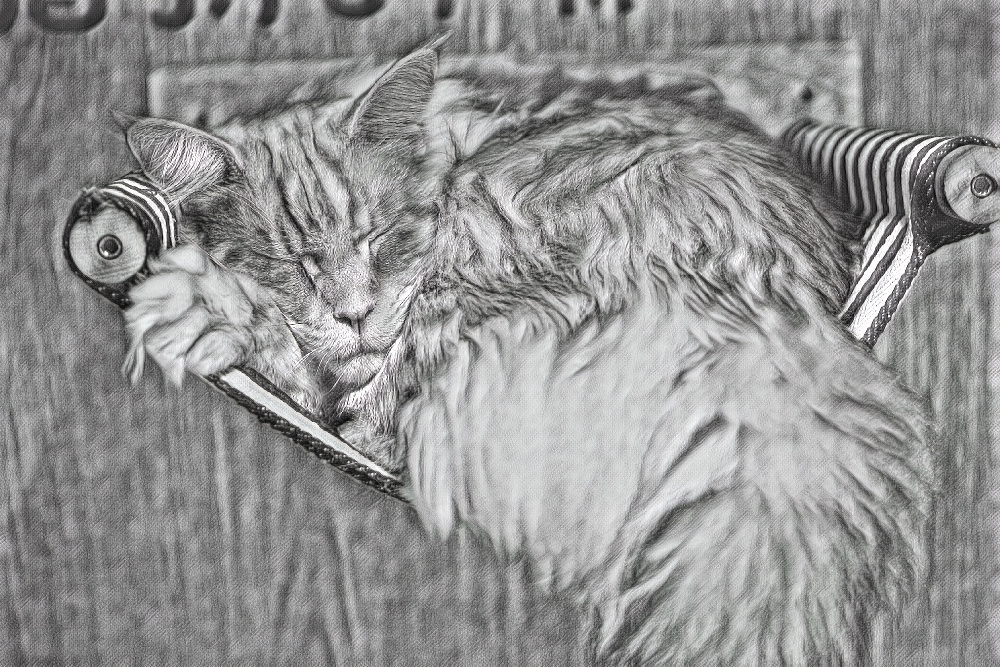
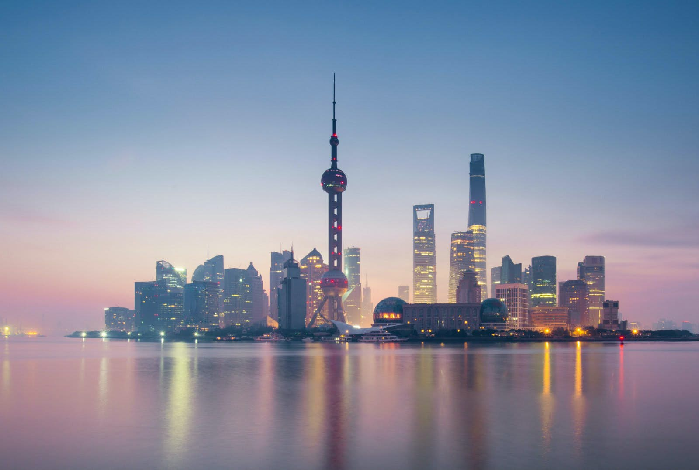
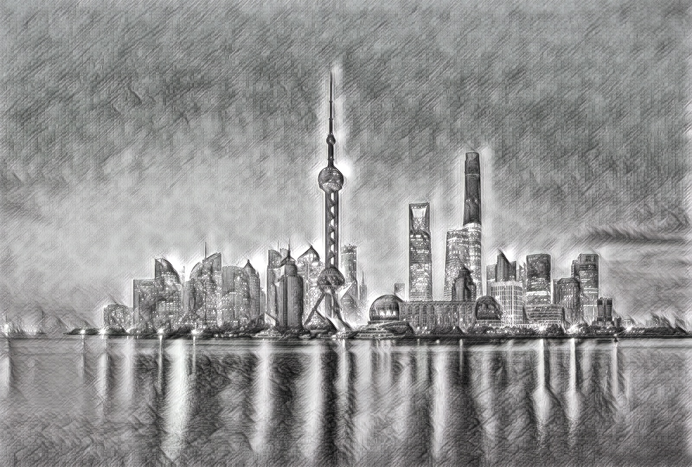
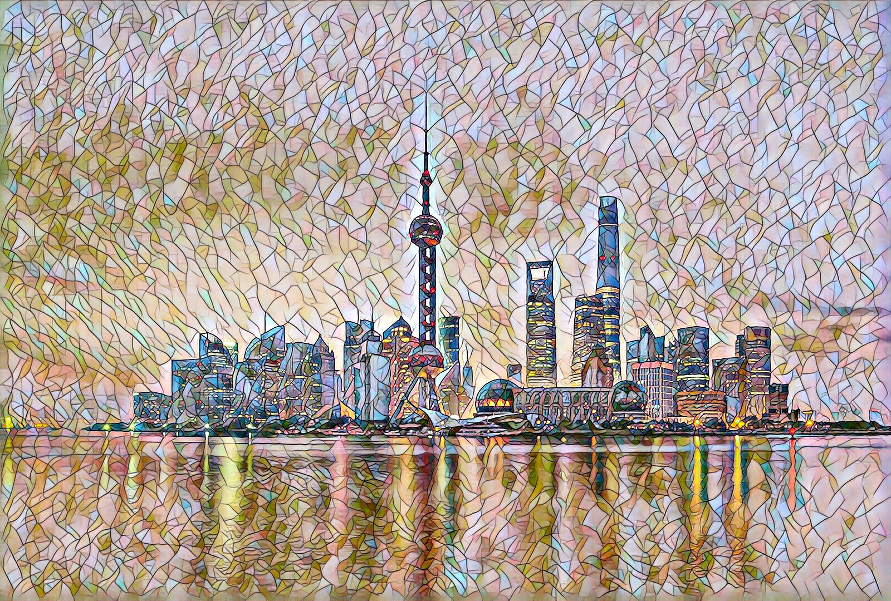
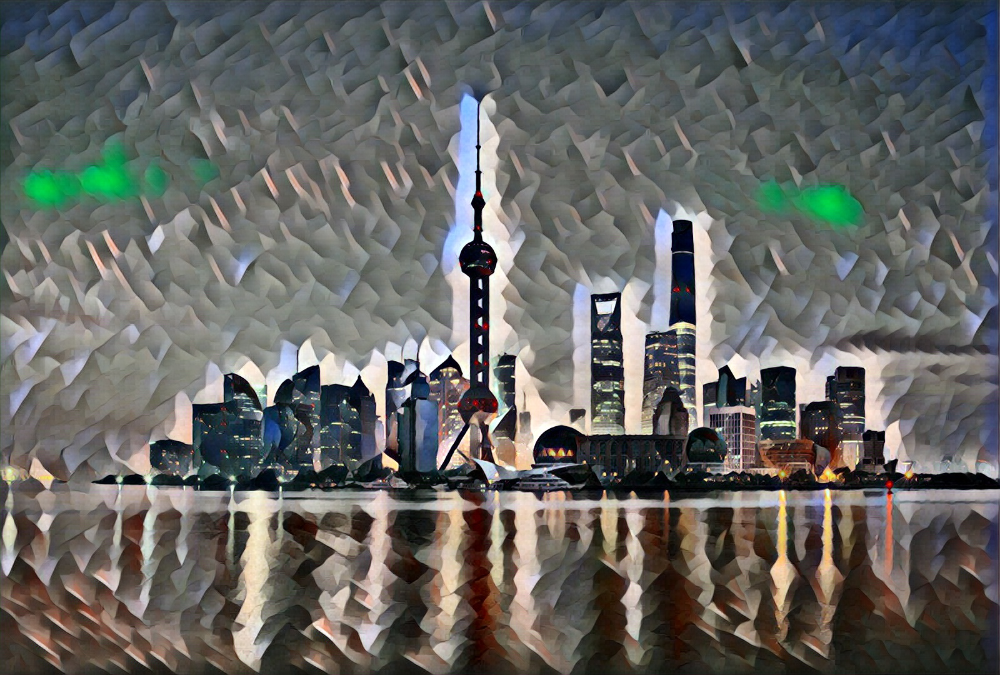
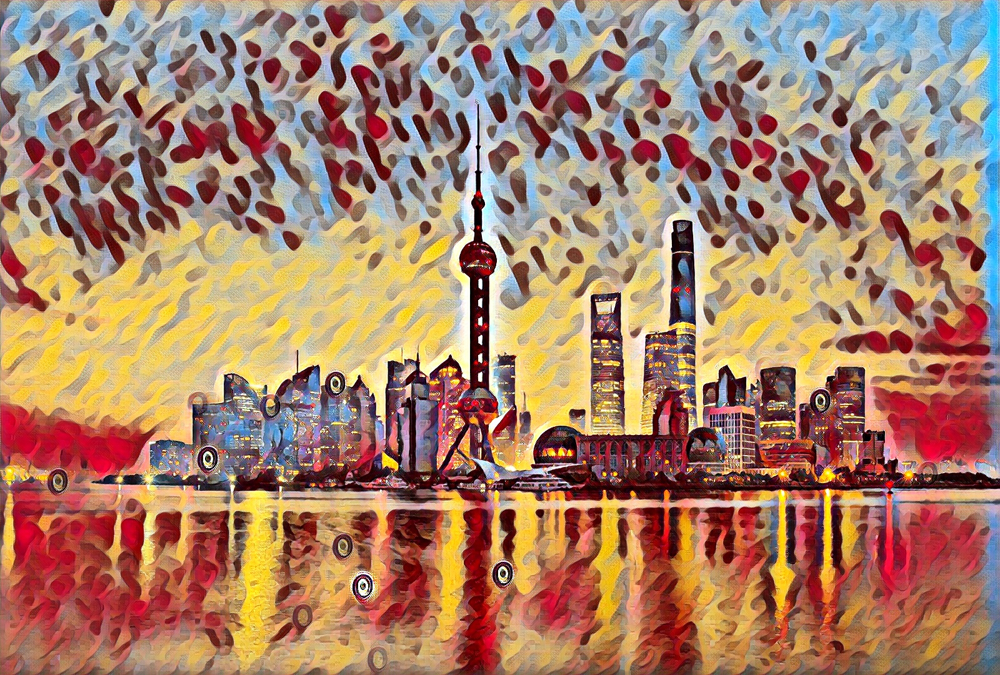
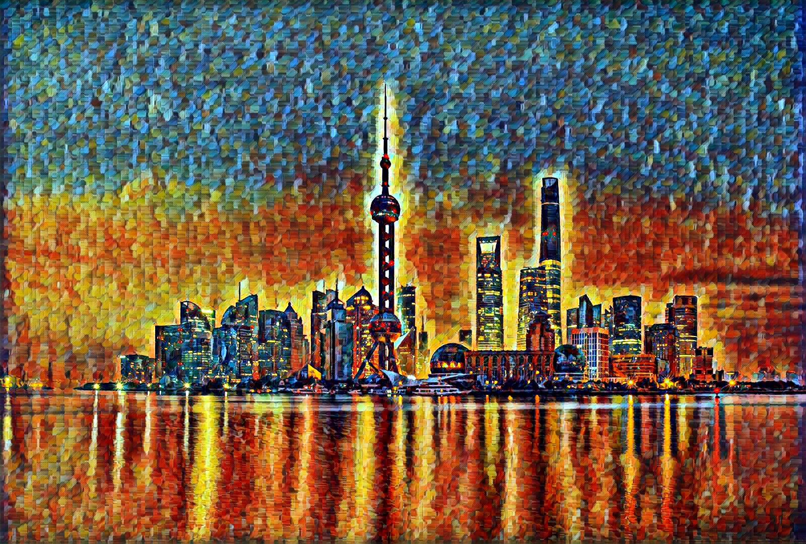

# fast-neural-style :city_sunrise: :rocket:
This repository contains a oneflow implementation of an algorithm for artistic style transfer. The algorithm can be used to mix the content of an image with the style of another image. 
## Results

The mosaic, candy, udnie, and rain princess style models are fine-tuned from pytorch official models. The sketch style model is trained in oneflow.

<p align="center">
    
    
    
</p>

<p align="center">
    
    
</p>

<p align="center">
    
    
</p>

<p align="center">
    
    
</p>

<p align="center">
    
    
</p>

<p align="center">
    
    
</p>

<p align="center">
    
    
</p>

## Infer and Train

For inferring, run
```
bash infer.sh
```
To customize infer process, see comment in `infer.sh`.

For training, first download coco dataset from http://msvocds.blob.core.windows.net/coco2015/test2015.zip.
Set dataset directory in train.sh. Hyperparameters can be customized. See comment in `train.sh`. Run
```
bash train.sh
```

Reference: https://github.com/pytorch/examples/tree/master/fast_neural_style